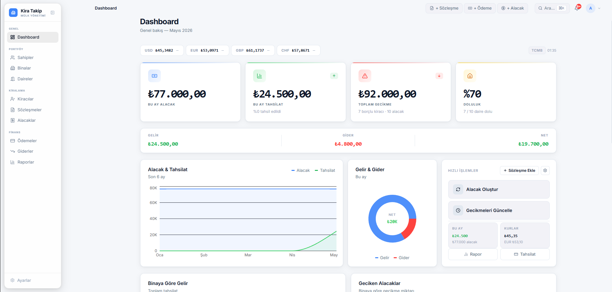
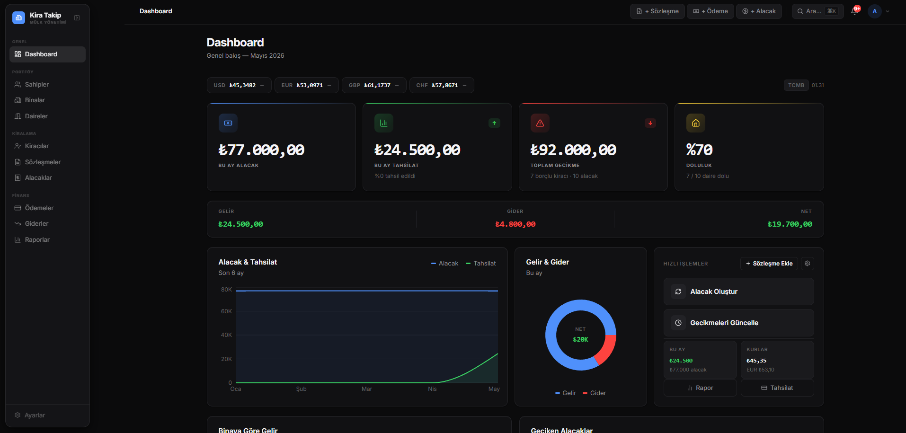
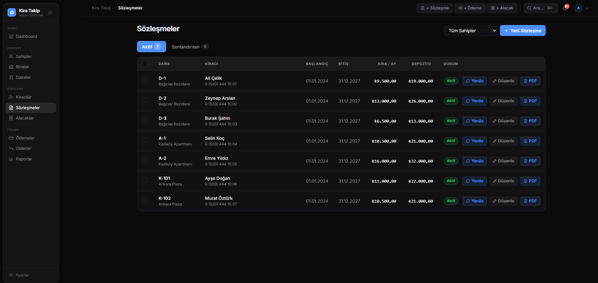
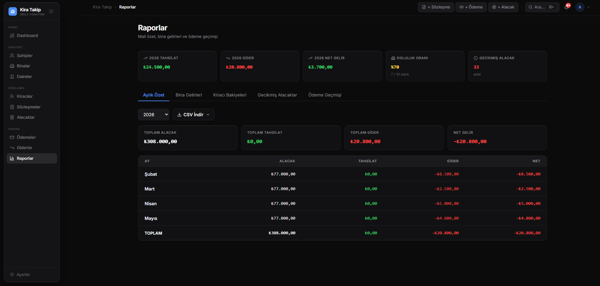
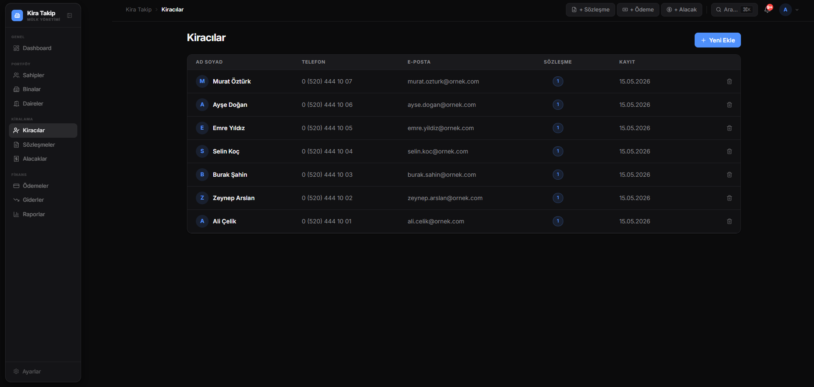
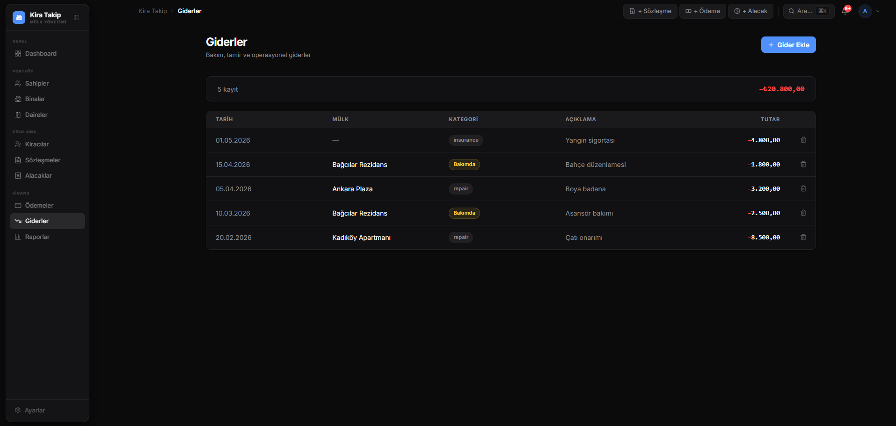

<div align="center">

# KiraTakip

**Gayrimenkul ofisleri ve mülk sahipleri için masaüstü kira yönetim uygulaması**

[](https://github.com/alperdb/kira-takip/releases)
[](https://github.com/alperdb/kira-takip/releases)
[](./LICENSE)
[](https://electronjs.org)
[](https://nextjs.org)
[](https://sqlite.org)

[**Indir (Windows)**](https://github.com/alperdb/kira-takip/releases/latest) &nbsp;·&nbsp; [Releases](https://github.com/alperdb/kira-takip/releases) &nbsp;·&nbsp; [English](#english)

<br />



</div>

---

## Nedir?

KiraTakip; birden fazla mülk, bina ve daireyi yöneten gayrimenkul ofisleri ve bireysel mülk sahipleri için geliştirilmiş **tamamen yerel çalışan** masaüstü uygulamasıdır.

Kurulum gerektirmez. Verileriniz yalnızca bilgisayarınızda saklanır — hiçbir bulut bağlantısı, abonelik veya internet erişimi gerekmez.

---

## Ekran Görüntüleri

<table>
<tr>
<td></td>
<td></td>
</tr>
<tr>
<td align="center"><sub>Dashboard — Koyu Tema</sub></td>
<td align="center"><sub>Dashboard — Açık Tema</sub></td>
</tr>
<tr>
<td></td>
<td></td>
</tr>
<tr>
<td align="center"><sub>Sözleşmeler</sub></td>
<td align="center"><sub>Raporlar</sub></td>
</tr>
<tr>
<td></td>
<td></td>
</tr>
<tr>
<td align="center"><sub>Kiracılar</sub></td>
<td align="center"><sub>Giderler</sub></td>
</tr>
</table>

---

## Kurulum

1. [Releases](https://github.com/alperdb/kira-takip/releases/latest) sayfasına git
2. `KiraTakip-v1.0.0-portable.zip` dosyasını indir
3. ZIP'i istediğin bir klasöre çıkart
4. `Kira Takip.exe` dosyasını çalıştır

İlk açılışta kurulum sihirbazı başlar: yönetici şifresi ve ofis bilgisi ayarlanır, ardından uygulama kullanıma hazır olur.

> Veriler `AppData\Roaming\Kira Takip\` konumunda yerel olarak saklanır.

---

## Özellikler

### Varlık Yönetimi
| | |
|---|---|
| **Mülk Sahipleri** | Sahip bilgileri, iletişim, portföy özeti |
| **Binalar & Daireler** | Hiyerarşik yapı, daire detayları, doluluk durumu |
| **Kiracılar** | Kiracı profili, aktif/pasif durum, finansal özet |

### Sözleşme & Ödeme
| | |
|---|---|
| **Sözleşme Yönetimi** | Oluşturma, yenileme, fesih — tam yaşam döngüsü |
| **Kira Alacakları** | Otomatik aylık alacak oluşturma, vade takibi |
| **Ödeme Kaydı** | Kısmi ödeme desteği, gecikme takibi, güvenilirlik skoru |

### Raporlama & Araçlar
| | |
|---|---|
| **Dashboard** | KPI kartları, tahsilat oranı, doluluk istatistikleri |
| **Finansal Zaman Çizelgesi** | Kiracı bazında tüm işlem geçmişi |
| **CSV Dışa Aktarma** | Excel uyumlu, filtreli veri export |
| **PDF Sözleşme** | Şablondan otomatik sözleşme oluşturma |
| **Global Arama** | `Ctrl+K` ile uygulama genelinde anlık arama |
| **Yedekleme** | Tek tıkla yedek alma ve geri yükleme |

### Sistem
| | |
|---|---|
| **Çoklu Kullanıcı** | Her hesap tamamen izole SQLite veritabanı |
| **Arşivleme** | Soft-delete — silinen kayıtlar kurtarılabilir |
| **Çevrimdışı** | İnternet bağlantısı gerektirmez |
| **Güvenlik** | bcrypt, session yönetimi, brute-force koruması |

---

## Teknoloji

```
Electron  ──  masaüstü sarmalayıcı (Windows)
Next.js   ──  App Router, TypeScript, sunucu bileşenleri
Prisma    ──  ORM, type-safe veritabanı erişimi
SQLite    ──  kullanıcı başına izole yerel veritabanı
```

**Mimari:** Tüm iş mantığı Next.js API route'larında — Electron yalnızca pencere açar. Bu sayede uygulama ileride web veya mobil platforma taşınabilir.

---

## Geliştirme

```bash
npm install
npx prisma generate
npx prisma db push
npm run dev              # http://localhost:3001
```

```bash
npm run electron:dev           # Electron ile çalıştır (dev mod)
npm run electron:build:win     # Sadece build (yükleme yapmaz)
```

---

## Lisans

MIT — bkz. [LICENSE](./LICENSE).

---

<a name="english"></a>

<div align="center">

# KiraTakip — English

**Desktop rental management application for real estate offices and property owners**

[**Download (Windows)**](https://github.com/alperdb/kira-takip/releases/latest) &nbsp;·&nbsp; [Releases](https://github.com/alperdb/kira-takip/releases)

</div>

---

## What is it?

KiraTakip is a **fully local** desktop application for real estate offices and individual property owners managing multiple properties, buildings, and units.

No installation required. Your data stays on your machine — no cloud, no subscription, no internet connection needed.

---

## Screenshots

<table>
<tr>
<td></td>
<td></td>
</tr>
<tr>
<td align="center"><sub>Dashboard — Dark Theme</sub></td>
<td align="center"><sub>Dashboard — Light Theme</sub></td>
</tr>
<tr>
<td></td>
<td></td>
</tr>
<tr>
<td align="center"><sub>Contracts</sub></td>
<td align="center"><sub>Reports</sub></td>
</tr>
<tr>
<td></td>
<td></td>
</tr>
<tr>
<td align="center"><sub>Tenants</sub></td>
<td align="center"><sub>Expenses</sub></td>
</tr>
</table>

---

## Installation

1. Go to the [Releases](https://github.com/alperdb/kira-takip/releases/latest) page
2. Download `KiraTakip-v1.0.0-portable.zip`
3. Extract the ZIP to any folder
4. Run `Kira Takip.exe`

On first launch the setup wizard runs: set an admin password and office name, then the app is ready.

> Data is stored locally in `AppData\Roaming\Kira Takip\`.

---

## Features

### Asset Management
| | |
|---|---|
| **Owners** | Owner profiles, contact info, portfolio overview |
| **Buildings & Units** | Hierarchical structure, unit details, occupancy status |
| **Tenants** | Tenant profiles, active/passive status, financial summary |

### Contracts & Payments
| | |
|---|---|
| **Contract Management** | Create, renew, terminate — full lifecycle |
| **Rent Receivables** | Automatic monthly charge generation, due date tracking |
| **Payment Recording** | Partial payment support, overdue tracking, reliability score |

### Reporting & Tools
| | |
|---|---|
| **Dashboard** | KPI cards, collection rate, occupancy stats |
| **Financial Timeline** | Per-tenant full transaction history |
| **CSV Export** | Excel-compatible, filtered data export |
| **PDF Contracts** | Automatic contract generation from template |
| **Global Search** | `Ctrl+K` instant search across the entire app |
| **Backup & Restore** | One-click backup and restore |

### System
| | |
|---|---|
| **Multi-user** | Each account has a fully isolated SQLite database |
| **Archiving** | Soft-delete — deleted records are recoverable |
| **Offline** | No internet connection required |
| **Security** | bcrypt, session management, brute-force protection |

---

## Tech Stack

```
Electron  ──  desktop wrapper (Windows)
Next.js   ──  App Router, TypeScript, server components
Prisma    ──  ORM, type-safe database access
SQLite    ──  isolated local database per user
```

**Architecture:** All business logic lives in Next.js API routes — Electron only handles the window. This keeps the app portable to web or mobile in the future.

---

## Development

```bash
npm install
npx prisma generate
npx prisma db push
npm run dev              # http://localhost:3001
```

```bash
npm run electron:dev           # run in Electron (dev mode)
npm run electron:build:win     # build only (no upload)
```

---

## License

MIT — see [LICENSE](./LICENSE).
